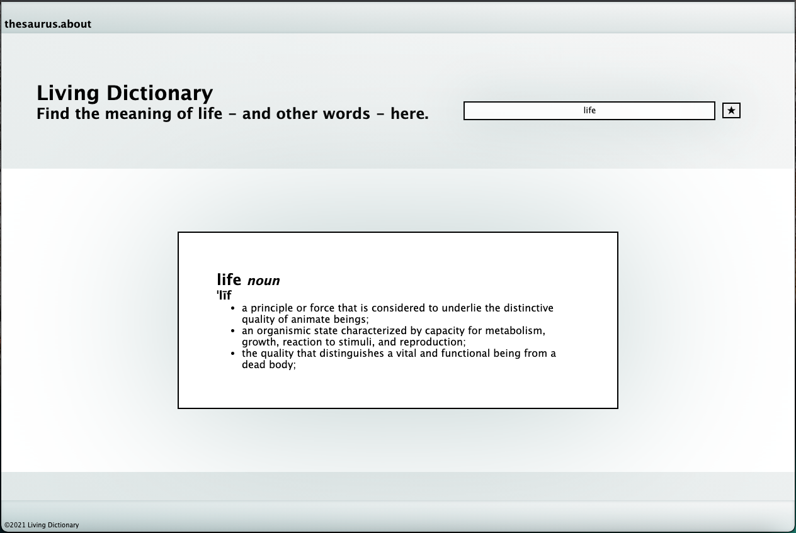
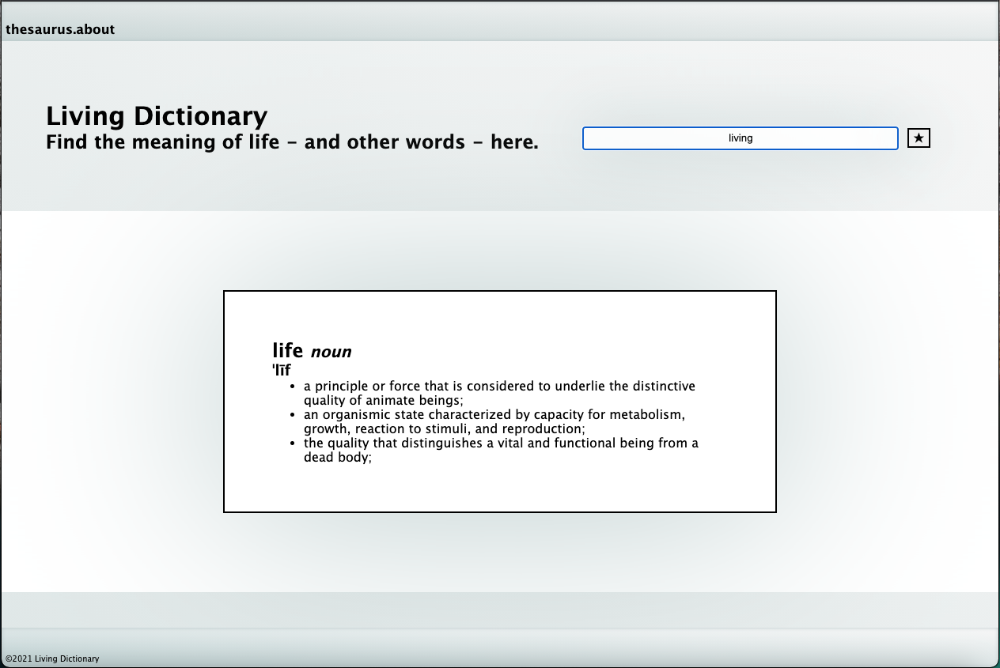
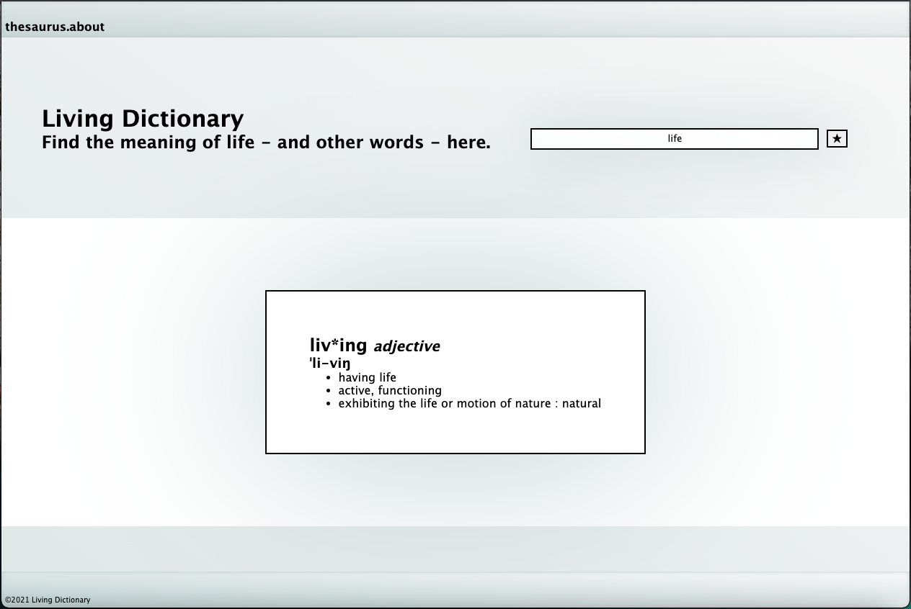

# Living Dictionary

A simple dictionary web application that allows users to search for the definition of a word of their choice.

## Technologies
- HTML5
- CSS3
- JavaScript/jQuery
- [Merriam-Webster API](https://www.dictionaryapi.com/products/api-collegiate-dictionary)

## Screenshots

- Landing page: 

  
- User enters input: 

- App displays definition with part of speech and pronunciation: 

## Getting Started
[Click Here](#) to see functional app. Type any english word into the input field, and hit 'enter' or click the &#8902; .

## Future Enhancements
- Add error message for "word not found" event.
- Display all definition word variations, organized by functional labels/parts of speech.
- Add "Similar Words" section which displays synonyms of user-defined search word. Listed similar words are hyperlinks targeting the definition page of the selected similar word.
- Add "Random Word" section which displays randomly selected word and minimal information about the word. 