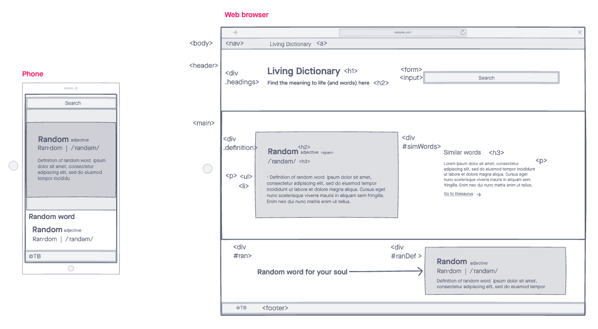

# Living Dictionary

A simple dictionary web app that allows users to search by keyword

## Technologies
- HTML5
- CSS3
- JavaScript/jQuery
- [Mirriam Webster API](https://www.dictionaryapi.com/api/v3/references/collegiate/json/)

## Screenshots

### Wireframes

## Images of Working App

## Getting Started
[Click here](#) to see working app

## Future Enhancements
- Add error message in event of word not found
- display word variations with differing function labels/parts of speech.
  